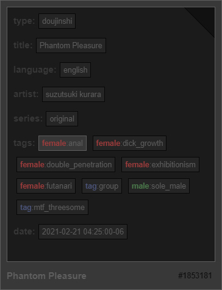

# READ ME

*Waifu Material* is a **Downloader** / **Viewer**  for [hitomi.la](https://hitomi.la).<br>

- [Extra Interaction](#extra-interaction)
  * [Fullscreen Shortcut](#fullscreen-shortcut)
  * [Paging Related](#paging-related)
  * [Gallery Related](#gallery-related)
- [Advanced Search](#advanced-search)
  * [Tag](#tag)
  * [Prefix](#prefix)
  * [Grouping](#grouping)
  * [Examples](#examples)

# Extra Interaction

This section describe extra interactions.

## Fullscreen Shortcut

Press <kbd>F11</kbd> will **enter** fullscreen.<br>
Press <kbd>F11</kbd> again will **leave** fullscreen.<br>
Also, upon **enter**ing fullscreen, both **TitleBar**, and **Paging** will become invisible.<br>

## Paging Related

It is an extra interaction for **Paging**.<br>
Press <kbd><</kbd> will **increase**, and <kbd>></kbd> will **decrease** the **Paging** index by 1.<br>

## Gallery Related

It is an extra interaction for **Gallery**.<br>
After hovering **Chip** just as picture below,<br>



**left-click** will **add** search term to **Query**,<br>
But **right-click** will do the opposite.<br>

# Advanced Search

This section describe advanced search.

## Tag

App offers special search terms apart from it's source site,<br>
Which are `id:<number>`, and `status:<NONE/FINISHED/WORKING/QUEUED/PAUSED/ERROR>`.<br>

## Prefix

There are total of 3 prefixes,<br>
Which are  `AND`, `INCLUDE`, and `EXCLUDE`.<br>
Prefix can be used simply by insert it at the start of either search term or a group, and is default of `AND`.<br>

```
AND
```

It computes the **common ground** with the one this prefix is appended from the previous result.<br>
*If no previous result has found, it works as same as `INCLUDE`.*

```
INCLUDE (+)
```

It **adds** the result of a search term this prefix is appended from previous result.<br>

```
EXCLUDE (-)
```

It **removes** the result of a search term this prefix is appended from previous result.<br>

## Grouping

It's possible to grouping search terms by putting inside `()`, and groups can stack.<br>
Computed result within a group affect outer result depends on group's prefix.<br>

## Examples

Followings are example of search terms, prefixes, and grouping.<br>

```
(language:korean +language:english) type:manga
```

*computes manga translated into either Korean or English.*<br>

```
tag:uncensored -(type:manga -(language:korean))
```

*computes uncensored (non-manga) galleries translated into Korean.*<br>
